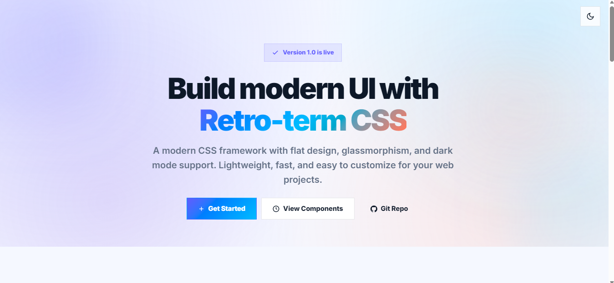
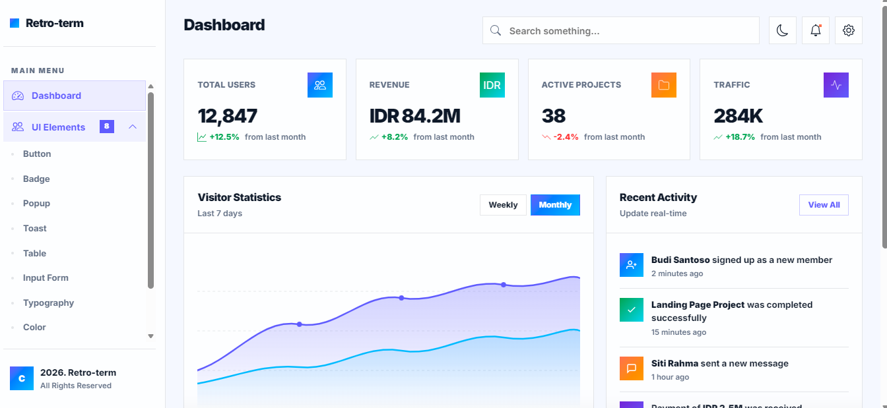
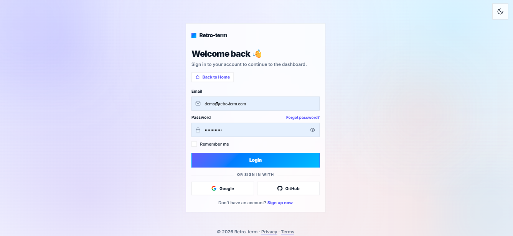

# Retro-term

Retro-term is a standalone retro-modern CSS framework for admin panels, dashboards, landing pages, documentation sites, and form-heavy interfaces.

No Bootstrap. No Tailwind. No external UI dependency.





## What It Includes

- Admin dashboard layout with sidebar, topbar, stat cards, charts, activity, and quick actions
- Landing page system with hero, feature cards, stats, CTA, timeline, and footer blocks
- Login page layout with centered auth card and form helpers
- CRUD table patterns with toolbar, responsive table wrapper, actions, modal forms, and pagination
- Core UI components such as buttons, badges, alerts, toasts, modals, dropdowns, navbar, accordion, carousel, and form controls
- Grid, spacing, and utility classes for fast composition
- Light and dark themes with localStorage persistence

## Quick Start

### CDN

```html
<link rel="stylesheet" href="https://cdn.jsdelivr.net/gh/afandisini/Retro-term@main/retro-term.min.css">
<script src="https://cdn.jsdelivr.net/gh/afandisini/Retro-term@main/retro-term.min.js" defer></script>
<link rel="stylesheet" href="https://cdn.jsdelivr.net/gh/afandisini/Retro-term@main/dist/retro-term-icons.css">
```

### NPM

```bash
npm install retro-term-css
```

```js
import "retro-term-css/css";
import "retro-term-css/js";
import "retro-term-css/icons";
```

### Starter Template

```html
<!DOCTYPE html>
<html lang="en" data-theme="light">
  <head>
    <meta charset="UTF-8" />
    <meta name="viewport" content="width=device-width, initial-scale=1.0" />
    <title>Retro-term</title>
    <link rel="stylesheet" href="dist/retro-term.min.css" />
    <link rel="stylesheet" href="dist/retro-term-icons.css" />
  </head>
  <body>
    <main class="rt-container rt-py4">
      <h1>Hello Retro-term</h1>
      <button class="btn btn-primary">Primary Action</button>
    </main>
    <script src="dist/retro-term.min.js" defer></script>
  </body>
 </html>
```

## Example Pages

- `example/dashboard.html`
- `example/landing-page.html`
- `example/login.html`
- `example/crud-table.html`
- `example/components-demo.html`

## Core Class Families

- Layout: `rt-admin`, `rt-sbr`, `rt-main`, `rt-topbar`, `rt-content`
- Grid: `rt-container`, `rt-row`, `rt-col-*`, `rt-g-*`
- Buttons: `btn`, `btn-primary`, `btn-secondary`, `btn-success`, `btn-warning`, `btn-danger`, `btn-ghost`, `btn-outline-primary`
- Forms: `rt-form-group`, `rt-form-label`, `rt-form-input`, `rt-form-select`, `rt-form-textarea`, `rt-form-check`
- Tables: `rt-table`, `rt-table-wrap`, `rt-table-toolbar`, `rt-table-pagination`, `rt-badge`
- Feedback: `rt-alert`, `rt-toast`
- Navigation: `rt-navbar`, `nav-dropdown`, `dropdown`
- Widgets: `rt-accordion`, `rt-carousel`, `rt-progress`, `rt-activity`, `rt-quick`
- Landing page: `rt-landing`, `rt-hero`, `rt-feature-grid`, `rt-cta`, `rt-footer`

## Build

```bash
npm install
npm run build
```

Build output regenerates:

- `retro-term.css`
- `retro-term.min.css`
- `dist/retro-term.css`
- `dist/retro-term.min.css`
- `dist/retro-term.js`
- `dist/retro-term.min.js`
- `dist/retro-term-icons.css`

## Notes

- Retro-term keeps the existing class prefixes and adds compatibility aliases where needed.
- The framework is designed to be used directly in vanilla HTML, PHP, Laravel, CodeIgniter, React, Vue, Next.js, Nuxt, Svelte, and Astro projects.
- Documentation lives in `DOCUMENTATION.md`.
