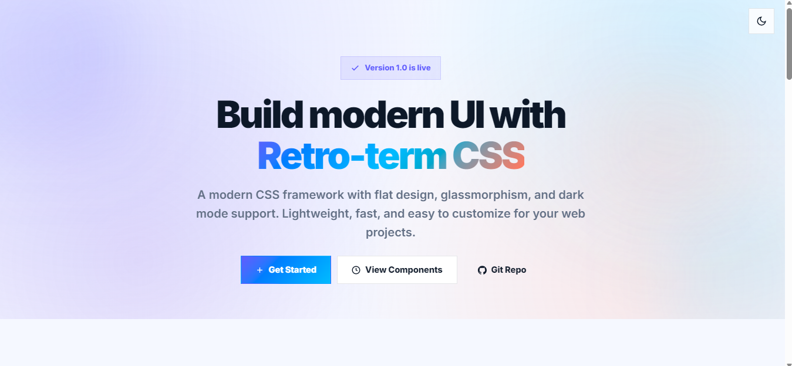
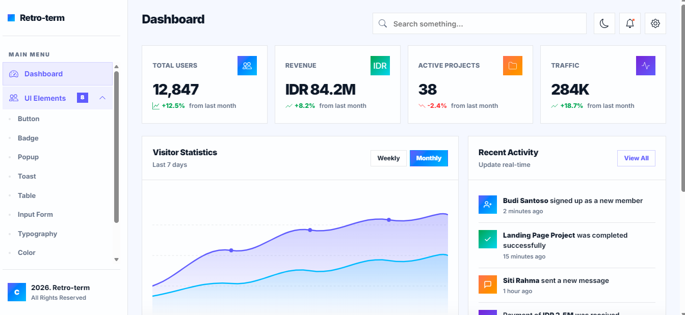
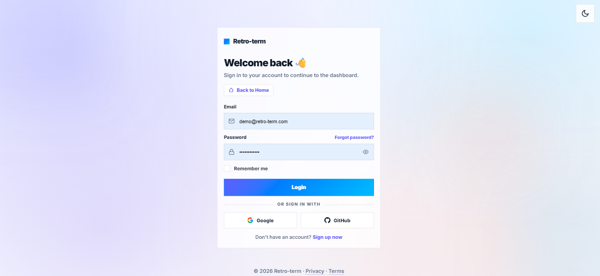

# Retro-term

Retro-term is a standalone CSS framework for dashboards, admin panels, documentation pages, internal tools, and landing pages.

No Bootstrap. No Tailwind. No external UI dependency.





## Installation

### npm

```bash
npm install retro-term-css
```

### pnpm

```bash
pnpm add retro-term-css
```

### yarn

```bash
yarn add retro-term-css
```

## CDN

### jsDelivr via npm

```html
<link
  rel="stylesheet"
  href="https://cdn.jsdelivr.net/npm/retro-term-css@2.1.0/dist/retro-term.min.css"
>
<script src="https://cdn.jsdelivr.net/npm/retro-term-css@2.1.0/dist/retro-term.min.js"></script>
```

The `/npm/` URL becomes available after `retro-term-css@2.1.0` is published to the npm registry. For production usage, prefer a pinned version such as `@2.1.0` instead of `@latest`.

### Optional icon pack

```html
<link
  rel="stylesheet"
  href="https://cdn.jsdelivr.net/npm/retro-term-css@2.1.0/dist/retro-term-icons.css"
>
```

## Package entry points

```js
import "retro-term-css/css";
import "retro-term-css/js";
import "retro-term-css/icons";
```

Sass entry:

```scss
@use "retro-term-css/scss";
```

## Starter template

```html
<!DOCTYPE html>
<html lang="en" data-theme="light">
  <head>
    <meta charset="UTF-8" />
    <meta name="viewport" content="width=device-width, initial-scale=1.0" />
    <title>Retro-term</title>
    <link rel="stylesheet" href="dist/retro-term.min.css" />
  </head>
  <body>
    <main class="rt-container rt-py4">
      <h1>Hello Retro-term</h1>
      <button class="rt-btn rt-btn-primary">Primary Action</button>
    </main>
    <script src="dist/retro-term.min.js"></script>
  </body>
</html>
```

If you need the bundled icon utilities, also load `dist/retro-term-icons.css`.

## Build

```bash
npm install
npm run build
```

Core build output:

- `dist/retro-term.css`
- `dist/retro-term.min.css`
- `dist/retro-term.js`
- `dist/retro-term.min.js`

Additional icon assets generated for the icon export:

- `dist/retro-term-icons.css`
- `dist/retro-term-icons.min.css`

## Capacitor app template

Retro-term also includes a mobile app starter for Capacitor in [`templates/capacitor`](templates/capacitor). It provides one WebView-based UI source for Android and iOS, including a mobile shell, bottom navigation, safe-area handling, theme toggle, and bottom sheet.

```bash
cd templates/capacitor
npm install
npm run android
# or
npm run ios
```

See [`templates/capacitor/README.md`](templates/capacitor/README.md) for platform requirements and sync commands.

## Repository notes

- Source Sass stays in `sass/`
- Distribution files are generated into `dist/`
- Publish workflow notes are available in `NPM_PUBLISH.md`
